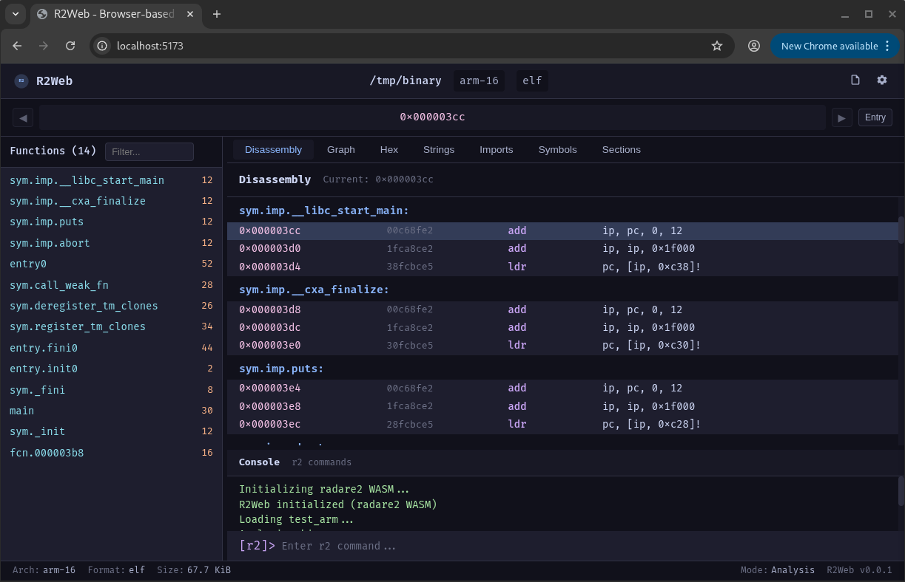

<div align="center">

# R2Web - Browser-based Reverse Engineering Platform

[](LICENSE)
[](https://webassembly.org/)
[](https://github.com/secnotes/r2web)
[](https://reactjs.org/)
[](https://www.typescriptlang.org/)
[](https://radare.org/)
[](https://emscripten.org/)

**A browser-based reverse engineering tool powered by [Radare2](https://github.com/radareorg/radare2) WebAssembly, similar to IDA Pro/Cutter/iaito.**

[English](README.md) | [中文](README_CN.md)

</div>

## Features

- 📁 **File Analysis** - Support for ELF, PE, Mach-O and other binary formats
- 🔍 **Disassembly View** - Assembly code with syntax highlighting
- 📊 **Control Flow Graph** - Visual CFG with proper edge routing
- 🔢 **Hex View** - Raw hex dump with ASCII representation
- 📝 **Strings View** - Extracted strings from binary
- 📋 **Functions List** - All functions with navigation
- 📦 **Sections/Symbols/Imports** - Binary structure overview
- 💻 **Console** - Interactive radare2 command interface
- 🎨 **Theme Support** - Light/Dark theme with system detection
- 🌐 **Multi-language** - English/Chinese interface

## Screenshots



## Quick Start

### Development

```bash
npm install
npm run dev
# Open http://localhost:5173
```

### Build

```bash
npm run build
```

## Tech Stack

- **Frontend**: React 19 + TypeScript + Vite
- **Styling**: CSS with Catppuccin theme
- **Backend**: radare2 compiled to WebAssembly via WASI
- **Runtime**: @wasmer/wasi for WASM execution

## Project Structure

```
r2web/
├── src/
│   ├── components/     # UI components
│   ├── hooks/          # React hooks (useR2)
│   ├── lib/            # Core logic (R2WasiRuntime, WASIInit)
│   ├── types/          # TypeScript definitions
│   ├── styles/         # CSS styles
│   └── wasm/           # radare2 WebAssembly modules
├── scripts/            # Build scripts
├── index.html
├── vite.config.ts
└── package.json
```

## WASM Modules

The project uses radare2 compiled to WebAssembly:

- `radare2.wasm` (~42MB) - Full analysis engine
- `rasm2.wasm` (~23MB) - Fast disassembly

These modules are loaded on-demand with progress tracking.

### Building WASM from Source

If you want to compile the WASM modules yourself:

1. Install [Emscripten SDK](https://emscripten.org/docs/getting_started/downloads.html):
   ```bash
   git clone https://github.com/emscripten-core/emsdk.git
   cd emsdk
   ./emsdk install latest
   ./emsdk activate latest
   source ./emsdk_env.sh
   ```

2. Clone and compile radare2:
   ```bash
   git clone https://github.com/radareorg/radare2.git
   cd radare2
   ./sys/emscripten.sh  # Output: dist/web/radare2.wasm
   ```

3. Copy WASM files to `src/wasm/`:
   ```bash
   cp dist/web/*.wasm ../r2web/src/wasm/
   ```

## Browser Requirements

- Modern browser with WebAssembly support
- SharedArrayBuffer enabled (requires COOP/COEP headers)
- Recommended: Chrome 88+, Firefox 89+, Safari 15+

## Related Projects

- [radare2](https://github.com/radareorg/radare2) - The reverse engineering framework
- [iaito](https://github.com/radareorg/iaito) - Qt GUI for radare2
- [Cutter](https://cutter.re/) - Modern radare2 GUI

## License

MIT License

## Contributing

Contributions are welcome! Please feel free to submit a Pull Request.